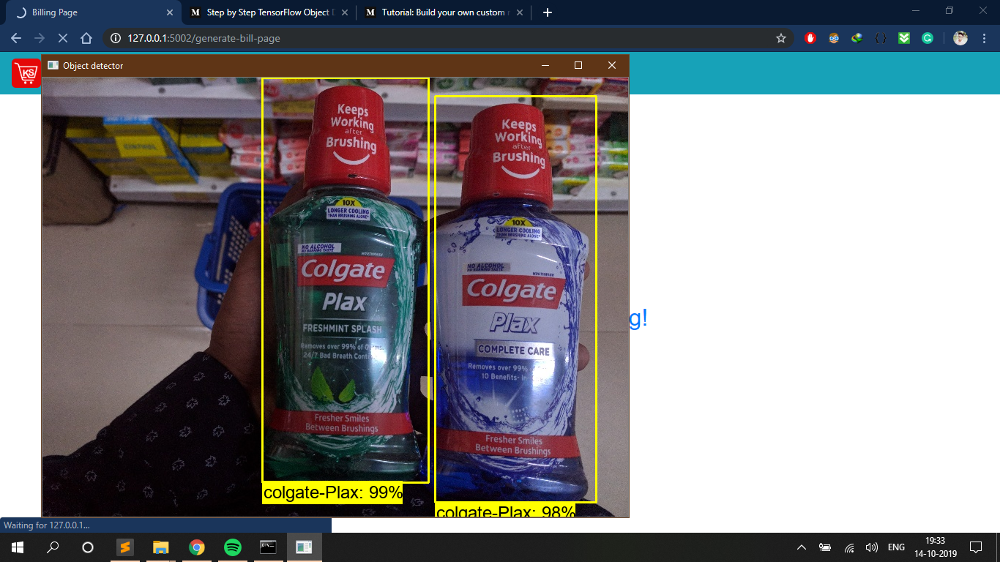
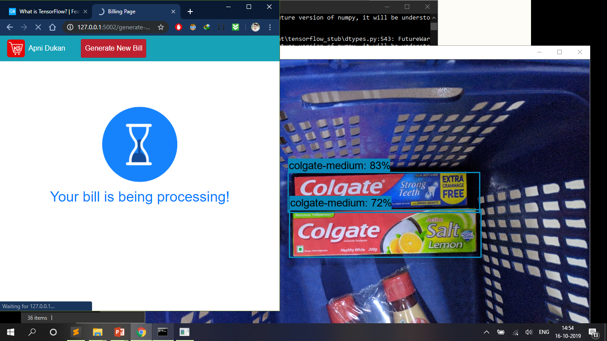
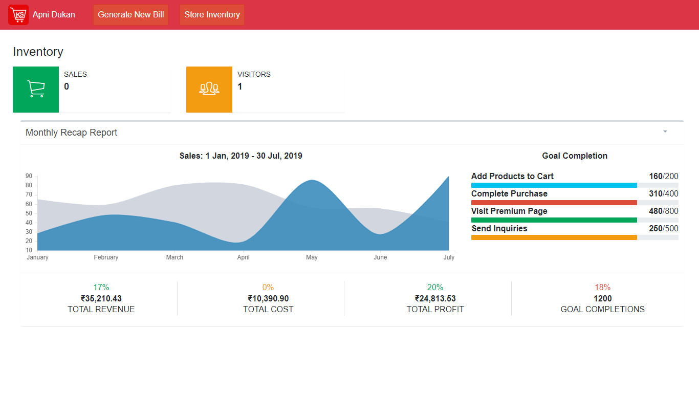
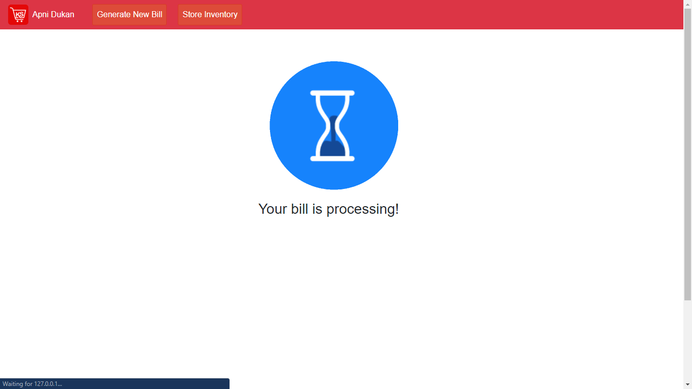
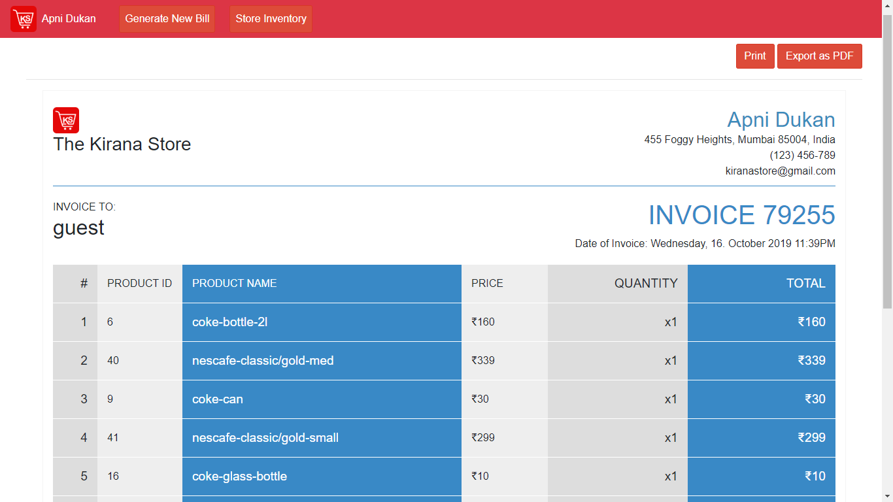
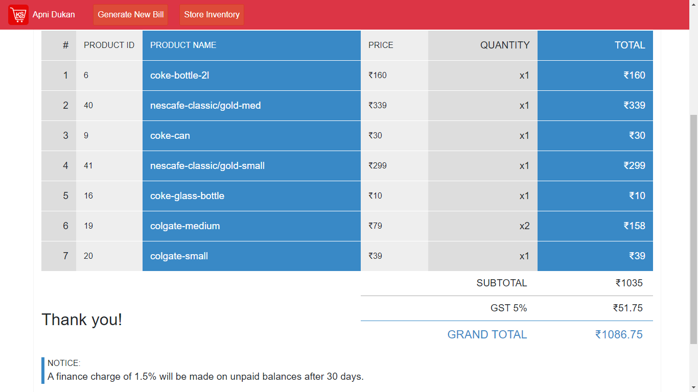

# How To Test Object Detection Classifier for Multiple Objects Using TensorFlow (GPU) on Windows 10

## Brief Summary
*Last updated: 10/18/2019 with TensorFlow v1.14*

*What this model can predict/detect ?*
<p> It can check upto 46 different items , which may have brand but different size.
	Brands it can detect:
	<ul>
	<li> 1. Coke Glass bottle , Can , Plastic bottle 300ml to 2L.</li>
	<li> 2. Colgate Small , Medium , Size , Plax.</li>
	<li> 3. Nescafe Cappuccino , Gold , Classic availabe in small and medium size.</li>
	<li> 4. Toothbush.</li>
	<li> 5. Gooday biscuit small , medium , large.</li>
	<li> 6. Lays small , medium , large/family.</li>
	<li> 7. Brittania Toast small , medium, large.</li>
	<ul>
	<p>
I also made a YouTube video that walks through this tutorial. Any discrepancies between the video and this written tutorial are due to updates required for using newer versions of TensorFlow. 

**If there are differences between this written tutorial and the video, follow the written tutorial!**

**Click on image below for Youtube tutorial**

[](https://www.youtube.com/embed/xyTsDTEi42E)

The repository provides all the files needed to test the daily life product detector that can accurately detect Coke can/bottle, Colgate, Colagate Plax, Lays (All sizes), Nescafe, Gooday Biscuit,  Maggi and toothbrush.  It also has Python scripts to test your classifier out on an image, video, or webcam feed.

<p align="center">
  
</p>

<p align="center">
  
</p>

## Introduction
The purpose of this tutorial is to explain how to test your own convolutional neural network object detection classifier for multiple objects, starting from scratch. At the end of this tutorial, you will have a program that can identify and it to a bill from objects in pictures, videos, or in a webcam feed.Also, this tutorial provides instructions for training a classifier that can detect multiple objects, not just one.

The tutorial is written for Windows 10, and it will also work for Windows 7 and 8. The general procedure can also be used for Linux operating systems, but file paths and package installation commands will need to change accordingly. I used TensorFlow-GPU v1.5 while writing the initial version of this tutorial, but it will likely work for future versions of TensorFlow.

TensorFlow-GPU allows your PC to use the video card to provide extra processing power while training, so it will be used for this tutorial. In my experience, using TensorFlow-GPU instead of regular TensorFlow reduces training time by a factor of about 8 (3 hours to train instead of 24 hours). The CPU-only version of TensorFlow can also be used for this tutorial, but it will take longer. If you use CPU-only TensorFlow, you do not need to install CUDA and cuDNN in Step 1. 

## Steps
### 1. Install Anaconda, CUDA, and cuDNN
Follow [this YouTube video by Mark Jay](https://www.youtube.com/watch?v=RplXYjxgZbw), which shows the process for installing Anaconda, CUDA, and cuDNN. You do not need to actually install TensorFlow as shown in the video, because we will do that later in Step 2. The video is made for TensorFlow-GPU v1.4, so download and install the CUDA and cuDNN versions for the latest TensorFlow version, rather than CUDA v8.0 and cuDNN v6.0 as instructed in the video. The [TensorFlow website](https://www.tensorflow.org/install/gpu) indicates which versions of CUDA and cuDNN are needed for the latest version of TensorFlow. 

If you are using an older version of TensorFlow, make sure you use the CUDA and cuDNN versions that are compatible with the TensorFlow version you are using. [Here](https://www.tensorflow.org/install/source#tested_build_configurations) is a table showing which version of TensorFlow requires which versions of CUDA and cuDNN.

Be sure to install [Anaconda](https://www.anaconda.com/distribution/#download-section) as instructed in the video, because the Anaconda virtual environment will be used for the rest of this tutorial. (Note: The current version of Anaconda uses Python 3.7, which is not officially supported by TensorFlow. However, when creating an Anaconda virtual environment during Step 2d of this tutorial, we will tell it to use Python 3.5.)

Visit [TensorFlow's website](https://www.tensorflow.org/install) for further installation details, including how to install it on other operating systems (like Linux). The [object detection repository](https://github.com/tensorflow/models/tree/master/research/object_detection) itself also has [installation instructions](https://github.com/tensorflow/models/blob/master/research/object_detection/g3doc/installation.md).

### 2. Set up TensorFlow Directory and Anaconda Virtual Environment
The TensorFlow Object Detection API requires using the specific directory structure provided in its GitHub repository. It also requires several additional Python packages, specific additions to the PATH and PYTHONPATH variables, and a few extra setup commands to get everything set up to run or train an object detection model. 

This portion of the tutorial goes over the full set up required. It is fairly meticulous, but follow the instructions closely, because improper setup can cause unwieldy errors down the road.

#### 2a. Download This repository from GitHub
Create a folder anywhere , and clone this reposistory
To clone this repop simply type this command in git bash <code>git clone https://github.com/sukhatmegaurav/Kirana-Web-App.git</code>

#### 2b. Download this tutorial's repository from GitHub
Download the full repository located on this page (scroll to the top and click Clone or Download) and extract all the contents directly into the C:\tensorflow1\models\research\object_detection directory. (You can overwrite the existing "README.md" file.) This establishes a specific directory structure that will be used for the rest of the tutorial. 

#### 2c. Set up new Anaconda virtual environment
Next, we'll work on setting up a virtual environment in Anaconda for tensorflow-gpu. From the Start menu in Windows, search for the Anaconda Prompt utility, right click on it, and click “Run as Administrator”. If Windows asks you if you would like to allow it to make changes to your computer, click Yes.

In the command terminal that pops up, create a new virtual environment called “tensorflow1” by issuing the following command:
```
C:\> conda create -n tensorflow1 pip python=3.5
```
Then, activate the environment and update pip by issuing:
```
C:\> activate tensorflow1

(tensorflow1) C:\>python -m pip install --upgrade pip
(tensorflow1) C:\>pip install -r requirements.txt
(Note if you don't have Tensorflow-gpu then open requirements.txt file and edit the part "tensorflow-gpu" with "tensorflow")
```
#### 2e. Configure PYTHONPATH environment variable
A PYTHONPATH variable must be created that points to the \models, \models\research, and \models\research\slim directories. Do this by issuing the following commands (from any directory):
```
(tensorflow1) C:\> set PYTHONPATH=C:\tensorflow1\models;C:\tensorflow1\models\research;C:\tensorflow1\models\research\slim
```
(Note: Every time the "tensorflow1" virtual environment is exited, the PYTHONPATH variable is reset and needs to be set up again. You can use "echo %PYTHONPATH% to see if it has been set or not.)

#### 2f. Compile Protobufs and run setup.py
Next, compile the Protobuf files, which are used by TensorFlow to configure model and training parameters. Unfortunately, the short protoc compilation command posted on TensorFlow’s Object Detection API [installation page](https://github.com/tensorflow/models/blob/master/research/object_detection/g3doc/installation.md) does not work on Windows. Every  .proto file in the \object_detection\protos directory must be called out individually by the command.

In the Anaconda Command Prompt, change directories to the \models\research directory:
```
(tensorflow1) C:\> cd C:\tensorflow1\models\research
```

Then copy and paste the following command into the command line and press Enter:
```
protoc --python_out=. .\object_detection\protos\anchor_generator.proto .\object_detection\protos\argmax_matcher.proto .\object_detection\protos\bipartite_matcher.proto .\object_detection\protos\box_coder.proto .\object_detection\protos\box_predictor.proto .\object_detection\protos\eval.proto .\object_detection\protos\faster_rcnn.proto .\object_detection\protos\faster_rcnn_box_coder.proto .\object_detection\protos\grid_anchor_generator.proto .\object_detection\protos\hyperparams.proto .\object_detection\protos\image_resizer.proto .\object_detection\protos\input_reader.proto .\object_detection\protos\losses.proto .\object_detection\protos\matcher.proto .\object_detection\protos\mean_stddev_box_coder.proto .\object_detection\protos\model.proto .\object_detection\protos\optimizer.proto .\object_detection\protos\pipeline.proto .\object_detection\protos\post_processing.proto .\object_detection\protos\preprocessor.proto .\object_detection\protos\region_similarity_calculator.proto .\object_detection\protos\square_box_coder.proto .\object_detection\protos\ssd.proto .\object_detection\protos\ssd_anchor_generator.proto .\object_detection\protos\string_int_label_map.proto .\object_detection\protos\train.proto .\object_detection\protos\keypoint_box_coder.proto .\object_detection\protos\multiscale_anchor_generator.proto .\object_detection\protos\graph_rewriter.proto .\object_detection\protos\calibration.proto .\object_detection\protos\flexible_grid_anchor_generator.proto
```
This creates a name_pb2.py file from every name.proto file in the \object_detection\protos folder.

**(Note: TensorFlow occassionally adds new .proto files to the \protos folder. If you get an error saying ImportError: cannot import name 'something_something_pb2' , you may need to update the protoc command to include the new .proto files.)**

Finally, run the following commands from the C:\tensorflow1\models\research directory:
```
(tensorflow1) C:\tensorflow1\models\research> python setup.py build
(tensorflow1) C:\tensorflow1\models\research> python setup.py install
```
 *Now You are ready to run the project*
### 8. Use Your Object Detection Classifier!
The object detection classifier is all ready to go! I’ve written Python scripts to test it out on an image, video, or webcam feed.

Before running the Python scripts, you need to modify the NUM_CLASSES variable in the script to equal the number of classes you want to detect.

To test your object detector, just open command prompt and type
<code>conda activate tensorflow1</code>
<code>python app.py</code>

Now you will see a new console have started in which you can check logs.

<p align="center">
  
</p>

*Steps to run the project*
<ul>
	
<li>Step.1 Now go to Generate bill button and click on it.Then you will we routed to another route.</li>
<li> Step.2 Now select images to perform detection.</li>
<li>Step.3 After all images are selected , just generate bill button.</li>
<li>Step.4 Now you will see a processing screen , after which you will we routed to Bill page.</li>
<p align="center">
  
</p>
<li>Step.5 Now after checking your products , you need to press print button to complete the order.</li>
<li>Step.6 You redirected back to inventory page where you will updated sales and other field</li>
</ul>

*Bill Page*
<p align="center">
  
</p>
 
*Continued*
<p align="center">
  
</p> redirected back to inventory page where you will updated sales and other field

*Bill*
<p align="center">
  
</p>
 
 Continued
<p align="center">
  
</p>
